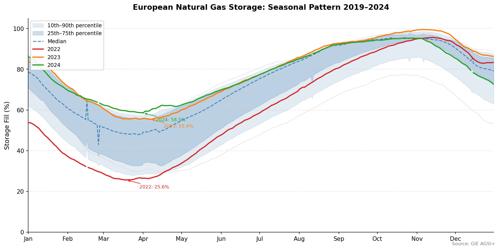
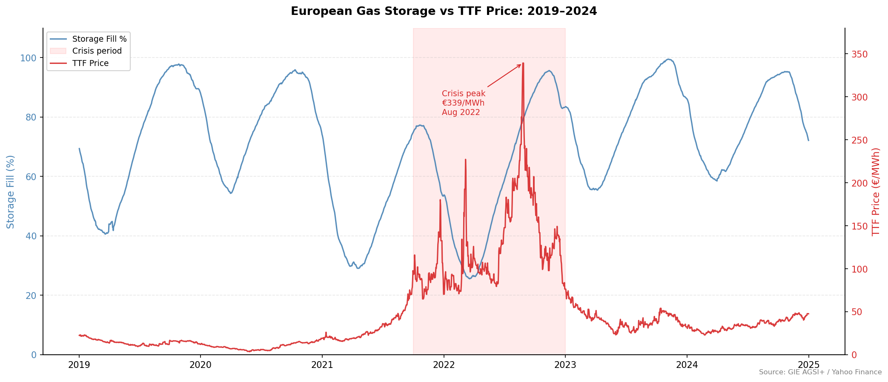
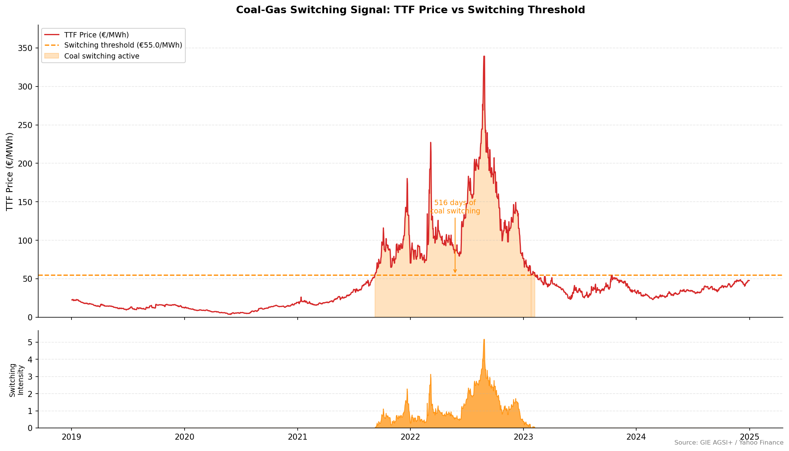

# European Natural Gas Storage Analysis
### Seasonal Dynamics, the 2022 Energy Crisis, and Coal-Gas Switching

---

## Overview

This project analyses European natural gas storage patterns from 2019 to 2024, 
examining how the seasonal injection/withdrawal cycle was disrupted by the 2022 
energy crisis and quantifying the coal-gas fuel switching dynamic driven by 
elevated TTF prices.

---

## Key Findings

| Metric | Value |
|--------|-------|
| Storage crisis trough | 25.6% (March 2022) - lowest in dataset |
| Price crisis peak | €339/MWh (August 2022) |
| Coal switching period | September 2021 - February 2023 |
| Total switching days | 516 |
| Peak switching intensity | 5.2× threshold |

---

## Methodology

**1. Seasonal Chart**  
Storage fill percentage plotted by day-of-year across all years. Historical 
distribution shown as a percentile band (10th–90th, 25th–75th). Identifies 
2022 as a structural outlier, storage broke below the 10th percentile floor 
in February 2022 and reached a historic low of 25.6% in March.


**2. Storage vs TTF Price Overlay**  
Dual-axis time series showing the inverse relationship between storage levels 
and TTF front-month futures price. The price peak of €339/MWh in August 2022 
lagged the storage trough by five months, reflecting forward-looking pricing 
of winter scarcity risk and storage optionality value, not spot scarcity.


**3. Coal-Gas Switching Signal**  
When TTF exceeds ~€55/MWh, gas-fired power generation becomes uneconomic 
relative to coal (accounting for thermal efficiencies and EU ETS carbon costs). 
The switching intensity metric quantifies how far above the threshold TTF traded. 
Active for 516 consecutive days from September 2021 to February 2023.


---

## Data Sources

| Source | Data | Access |
|--------|------|--------|
| GIE AGSI+ | European gas storage fill % | Free API (registration required) |
| Yahoo Finance | TTF front-month futures (TTF=F) | Free via yfinance |

---

## Project Structure
european-energy-storage/
├── notebooks/
│   └── 01_eia_storage_analysis.ipynb  # Main analysis notebook
├── src/
│   ├── data_pipeline.py               # Data acquisition + caching
│   ├── analysis.py                    # Quantitative calculations
│   └── visualisation.py              # Chart functions
├── tests/
│   └── test_pipeline.py
├── requirements.txt
└── README.md

## Installation

```bash
git clone https://github.com/addzzz786/european-energy-storage.git
cd european-energy-storage
pip install -r requirements.txt
```

Set your AGSI API key (register free at agsi.gie.eu):

```bash
# Create .env file
echo "AGSI_API_KEY=your_key_here" > .env
```

Then open `notebooks/01_eia_storage_analysis.ipynb` and run all cells.

---

## Requirements
pandas
requests
matplotlib
yfinance
python-dotenv
pyarrow

*Data source: GIE AGSI+ transparency platform*